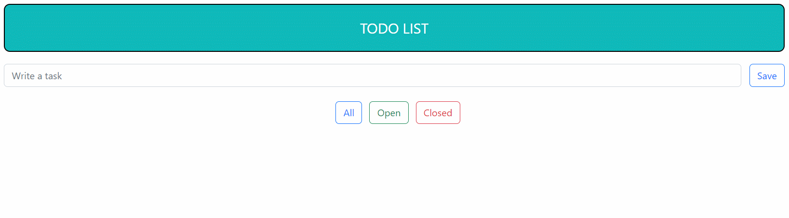

<h1 align="center">TodoList with Local Storage</h1>

<h2 align="center"><a  href="https://mnetace.github.io/local-todo-list-react/">Live Demo</a></h2>

## Description

**NOW WITH LOCALE STORAGE**

TodoList implemented by scratch on React.js. It contains 3 types of filters namely "All' (which shows all the tasks), "Open" (only active tasks) and "Closed" (only closed tasks). I've learned web development myself so don't expect too much from the source code xD.

**This project is inspired by REDEV-community, which you can find out about [Here](https://www.instagram.com/redev_courses/).**
